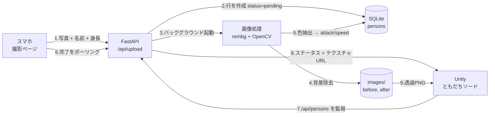

# チーム名

<!-- TODO: チーム名を記載してください -->

# ともだちソード

## 概要

スマホで友達を撮影すると、その写真がそのまま「剣」になって対戦できる 2人用の格闘ゲームです。

撮影した人物は背景を自動で除去され、シルエットを押し出した 3D メッシュとして Unity 上に出現します。
身長から刀身の長さと攻撃範囲が、服の色（彩度・明度）から攻撃力とスピードが決まるので、
撮る相手が変われば毎回まったく違う武器が生まれます。

QR コードを読んで写真を送るだけで、その場にいる友達が数秒後には武器になっている、という体験を狙いました。

## デモ

- 発表資料URL：<!-- TODO: 必須 -->
- デモURL：<!-- TODO: 任意 -->
- デモ動画：<!-- TODO: 任意 -->


- スクリーンショット：<!-- TODO: 撮影ページ / 錬成画面 / 対戦画面 の3枚を推奨 -->

## システム構成



サーバー・ゲーム・スマホはすべて HTTP で疎結合になっているため、**1台に集約せず役割ごとに別の PC で動かせます**。
DB と画像はサーバー機の1箇所にしか存在せず、他はすべて API 経由で取得します。

| 役割 | 動かすもの |
| --- | --- |
| サーバー機 | FastAPI + SQLite + 画像処理 |
| ゲーム機 | Unity（`/api/persons` を参照） |
| スマホ | ブラウザで撮影ページを開くだけ |

## 背景・課題

「その場の友達と盛り上がれるゲーム」を作りたい、というのが出発点でした。

対戦ゲームは数多くありますが、**登場するキャラクターが最初から用意されている**ため、
どうしても「与えられたものを選ぶ」体験になります。
一方で、自分たちの写真が入るゲームは、写真がただ貼り付けられるだけで、
プレイの中身に影響しないものがほとんどです。

そこで、**撮った写真そのものがゲームバランスを決める**構造にしました。
背が高い友達の剣はリーチが長く、派手な服の友達は攻撃力が高い。
「誰を撮るか」が戦略になるので、その場にいる人が多いほど盛り上がります。

技術的な課題は、写真1枚から遊べる武器を作るまでを**数秒で終わらせる**ことでした。
待ち時間が長いと、その場のノリが切れてしまいます。

## 主な機能

- **スマホからの撮影・送信** — QR を読むだけでブラウザが開き、写真・名前・身長を送信
- **背景の自動除去** — rembg で人物だけを切り抜き、透過 PNG として保存
- **服の色からのステータス生成** — 人物領域の平均 HSV を取り、彩度・明度を攻撃力とスピードに反映
- **身長に応じた 3D モデル生成** — シルエットを押し出してメッシュ化。身長がそのまま刀身の長さと攻撃範囲になる
- **新着の自動検出** — Unity が `/api/persons` を監視し、写真が届いた瞬間に錬成演出へ移行
- **2人対戦** — 生成した剣で戦う。既存の剣を選ぶことも可能

## 工夫した点・こだわった点

**待たせない非同期パイプライン**

画像処理には 10〜15 秒かかります。これを同期処理にすると、送信ボタンを押したスマホが固まってしまいます。
そこで `/api/upload` は**行を作った時点ですぐ 200 を返し**、重い処理はバックグラウンドへ回しました。
DB の `status` 列が `pending → processing → done`（失敗時は `failed`）と遷移するので、
スマホも Unity も同じ仕組みで進行を追えます。

**Unity 側の「新着」判定**

QR を表示した時点で存在する id を控えておき、そこに無い id が現れたらそれがその人の剣、という差分検出にしました。
`/api/persons` は処理が完走した行だけを返すため、**処理途中の中途半端なデータを拾うことがありません**。

**姿勢推定に頼らない色抽出**

当初は MediaPipe Pose で肩と腰のランドマークを取り、その内側を服の色として抽出していました。
しかし Python 3.13 環境では mediapipe から Solutions API が削除されており、実行時に落ちてしまいます。

そこで**背景除去で得られるアルファチャンネル自体を人物領域として使う**方式に切り替えました。
姿勢推定なしで成立するため依存が減り、モデルファイルの配布も不要になっています。

**写真から立体を作る**

シルエットの輪郭セルごとに側面を張り、前面・背面と合わせて閉じたメッシュを組み立てています。
透明な余白の量が写真ごとに違っても人物の大きさが変わらないよう、
頭の中心を原点に取って身長方向で正規化しました。

## 使用技術

- **フロントエンド**：HTML / CSS / JavaScript（撮影ページ、ビルド不要の単一ファイル構成）
- **バックエンド**：Python 3.13 / FastAPI 0.141 / Uvicorn 0.52
- **画像処理**：rembg 2.0（背景除去・ONNX Runtime）/ OpenCV 5.0 / NumPy / Pillow
- **ゲーム**：Unity 6000.5.6f1 / C#（メッシュ動的生成、UI もスクリプトから構築）
- **データベース**：SQLite（WAL モード）
- **インフラ**：ローカル LAN（サーバー・ゲーム機・スマホを同一ネットワークに接続）

## 今後の展望

- **掛け声の生成** — API の `audio_url` は契約だけ通してあり、実装すれば Unity 側は無改修で音が鳴ります
- **戦績の記録** — `matches` テーブルは用意済みですが、まだエンドポイントがありません。勝敗を残してランキング化したいです
- **立体感の向上** — 現在は一定の厚みで押し出しているため、横から見ると板状に見えます。中心ほど厚くする方式を検討中です
- **QR の動的生成** — 今は静的画像なので、サーバーの IP が変わるたびに作り直す必要があります
- **3人以上での対戦** — トーナメント形式にすれば、その場の人数が多いほど盛り上がります

## セットアップ方法

### 必要なもの

- Python 3.13
- Unity 6000.5.6f1
- サーバー機・ゲーム機・スマホが**同一ネットワーク**にあること

### バックエンド

```bash
git clone https://github.com/c1417005/Hackit.git
cd Hackit

# 仮想環境を作成
python -m venv venv

# 依存ライブラリをインストール（rembg のモデル取得で初回は時間がかかります）
./venv/Scripts/python.exe -m pip install -r requirements.txt

# 起動（必ずリポジトリのルートから）
./venv/Scripts/python.exe -m uvicorn backend.main:app --host 0.0.0.0 --port 8000
```

Windows の PowerShell / cmd では、パス区切りをバックスラッシュにしてください。

```powershell
venv\Scripts\python.exe -m uvicorn backend.main:app --host 0.0.0.0 --port 8000
```

`--host 0.0.0.0` は必須です。これを省くと他の PC やスマホから接続できません。
初回起動時に Windows ファイアウォールの確認が出たら「プライベートネットワーク」を許可してください。

詳しい起動手順とトラブルシューティングは [docs/run-server.md](docs/run-server.md) にまとめてあります。

### 動作確認

```
http://127.0.0.1:8000/health   → {"ok":true}
```

サーバー機で `ipconfig` を実行し、Wi-Fi アダプタの IPv4 を確認します。
スマホのブラウザで次を開くと撮影ページが表示されます。

```
http://<サーバーのIP>:8000/
```

### Unity

1. `Hackit_tomodati-sord/` を Unity Hub で開く
2. `SwordRepository` の `localApiBaseUrl` にサーバーの URL（`http://<サーバーのIP>:8000`）を設定
3. 撮影ページの URL を QR 画像にして、`ForgeUI` の `qrImage` に設定
4. 再生

サーバーに接続できない場合はモックデータで起動します。
その際は Console に `[LocalAPI] 一覧取得失敗` が出るので、URL とサーバーの起動状態を確認してください。

## メンバー

<!-- TODO: 氏名と担当を記入してください。以下は commit 履歴からの推定です -->

| 名前 | 担当 |
|------|------|
| 藤田 優翔| Unity（対戦・剣生成・UI） |
| 表田 峻輔 | Unity / （バックエンド・モデリング） |
| 福島 颯 | バックエンド |
| 伊藤 奏汰 | 画像処理（背景除去・色抽出） |
| 鈴木 輝空 | Unity /(モデリング) |
