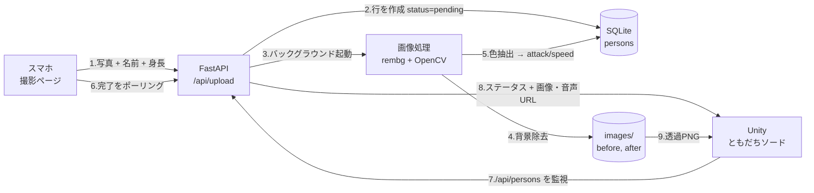
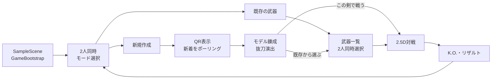

# チーム名

<!-- TODO: チーム名を記載してください -->

# ともだちソード

## 概要

スマホで友達を撮影すると、その写真がそのまま「剣」になって対戦できる 2人用の格闘ゲームです。

撮影した人物は背景を自動で除去され、シルエットを押し出した 3D メッシュとして Unity 上に出現します。
身長から刀身の長さと攻撃範囲が、服の色（彩度・明度）から攻撃力とスピードが決まるので、
撮る相手が変われば毎回まったく違う武器が生まれます。

QR コードを読んで写真を送るだけで、その場にいる友達が数秒後には武器になっている、という体験を狙いました。

ゲーム開始時は、各プレイヤーが「新しく友達を撮影して武器を作る」か「登録済みの武器から選ぶ」かを選択できます。
対戦中は剣と斧を切り替えられ、移動・溜め攻撃・回避を使った駆け引きを楽しめます。

## デモ

- 発表資料URL：<!-- TODO: 必須 -->
- デモURL：<!-- TODO: 任意 -->
- デモ動画：<!-- TODO: 任意 -->


- スクリーンショット：<!-- TODO: 撮影ページ / 錬成画面 / 対戦画面 の3枚を推奨 -->

## システム構成



サーバー・ゲーム・スマホはすべて HTTP で疎結合になっているため、**1台に集約せず役割ごとに別の PC で動かせます**。
DB と画像はサーバー機の1箇所にしか存在せず、他はすべて API 経由で取得します。

| 役割 | 動かすもの |
| --- | --- |
| サーバー機 | FastAPI + SQLite + 画像処理 |
| ゲーム機 | Unity（`/api/persons` を参照） |
| スマホ | ブラウザで撮影ページを開くだけ |

## 背景・課題

「その場の友達と盛り上がれるゲーム」を作りたい、というのが出発点でした。

対戦ゲームは数多くありますが、**登場するキャラクターが最初から用意されている**ため、
どうしても「与えられたものを選ぶ」体験になります。
一方で、自分たちの写真が入るゲームは、写真がただ貼り付けられるだけで、
プレイの中身に影響しないものがほとんどです。

そこで、**撮った写真そのものがゲームバランスを決める**構造にしました。
背が高い友達の剣はリーチが長く、派手な服の友達は攻撃力が高い。
「誰を撮るか」が戦略になるので、その場にいる人が多いほど盛り上がります。

技術的な課題は、写真1枚から遊べる武器を作るまでを**数秒で終わらせる**ことでした。
待ち時間が長いと、その場のノリが切れてしまいます。

## 主な機能

- **スマホからの撮影・送信** — QR を読むだけでブラウザが開き、写真・名前・身長を送信
- **背景の自動除去** — rembg で人物だけを切り抜き、透過 PNG として保存
- **服の色からのステータス生成** — 人物領域の平均 HSV を取り、彩度・明度を攻撃力とスピードに反映
- **身長に応じた 3D モデル生成** — シルエットを押し出してメッシュ化。身長がそのまま刀身の長さと攻撃範囲になる
- **新着の自動検出** — Unity が `/api/persons` を監視し、写真が届いた瞬間に錬成演出へ移行
- **2人同時の武器選択** — 新しく錬成するか、登録済みの武器を選ぶかをプレイヤーごとに選択
- **2人対戦** — 横固定カメラの 2.5D ステージで、移動・溜め斬り・回避・剣／斧の切り替えを使って対戦
- **人物固有の音声** — API の `audio_url`（または `voice_url`）を取得し、その武器の攻撃モーション時に再生
- **コード生成の演出と UI** — 錬成、抜刀、HP、ヒット、K.O.、効果音を Unity 側で構築し、追加アセットへの依存を抑制

## Unity 実装

### ゲーム進行



2人が別々のモードを選ぶこともできます。両方が新規作成を選んだ場合は、QR・錬成画面を1人ずつ順番に進めます。

### 主要スクリプト

| スクリプト | Unity 側での役割 |
| --- | --- |
| `GameBootstrap.cs` | `SampleScene` の起点。ステージ、進行、UIを順番に組み立てる |
| `BattleStageInstaller.cs` | 地面、横固定カメラ、2人のファイター、KIT風背景を実行時に生成 |
| `FlowInstaller.cs` / `DuelManager.cs` | モード選択 → QR・錬成 → 武器選択 → 対戦 → リザルトの状態管理 |
| `SwordRepository.cs` | Local API の `/api/persons`、人物画像、人物固有音声を取得。失敗時はモックへフォールバック |
| `SwordBuilder.cs` / `TposeSwordMeshBuilder.cs` | 透過人物画像からTポーズの立体メッシュと攻撃判定を生成 |
| `Fighter.cs` | 移動、溜め攻撃、回避、剣／斧モード、HP、連続衝突判定を管理 |
| `HandVisualFactory.cs` | 武器を握る手の見た目を生成。専用Prefabが無い場合は簡易モデルへフォールバック |
| `SwordSelectUI.cs` | 人物を大きく表示する2人用武器選択画面。攻撃・速度・身長をバー表示 |
| `ForgeUI.cs` | QR、錬成中、新しい友達の出現、抜刀、使用確認の演出 |
| `BattleHud.cs` / `HpBarUI.cs` | 2人分のHP、武器名、対戦HUDを表示 |
| `BattleEffects.cs` / `HitStop.cs` | 攻撃音、ヒット、ダメージ数字、カウントダウン、K.O.、ヒットストップ |
| `BackNavigationUI.cs` | 各画面からモード選択へ安全に戻す共通操作 |

### Unity 側の設計ポイント

- `SampleScene` には起点となる `GameBootstrap` を置き、対戦オブジェクトとUIの大半をコードから生成します。複数人が同じ `.unity` ファイルを編集して起きる競合を抑えています。
- 移動と当たり判定はX/Y平面のままです。横斬り中だけ剣の**見た目**をZ方向へ動かし、カメラ側へ迫る2.5D演出を付けています。
- 武器の全長と攻撃範囲は `height` のみから決定します。`attack` はダメージ、`speed` は移動速度と攻撃時間へ反映し、`defense` は使用しません。
- 剣モードは素早く、斧モードは遅い代わりに高威力です。斧モードでは人物モデルを反転し、足側を持ち手として表示します。
- HPは `200`。攻撃ボタンを長押しすると最大1.9倍まで威力が上がりますが、攻撃後の隙も大きくなります。
- Local APIや画像の取得に失敗しても、モック武器と手続き生成テクスチャで進行し、デモを止めません。

### Local API から受け取る値

| `/api/persons` の値 | Unity での利用先 |
| --- | --- |
| `id` | 武器ID、新着判定、画像・音声キャッシュのキー |
| `name` | 武器選択、対戦HUD、リザルトの表示名 |
| `height` | `height_cm` として保持し、モデル全長・攻撃範囲・SIZE表示に使用 |
| `attack` | ATK表示とダメージ計算 |
| `speed` | SPEED表示、移動速度、剣を振る速さ |
| `after_url` | 背景除去済み人物画像。相対URLの場合は `localApiBaseUrl` を補完 |
| `audio_url` / `voice_url` | 人物固有の攻撃ボイス。無い場合も音声なしで続行 |

## 操作方法

| 操作 | DualShock 4 | 1P キーボード | 2P キーボード |
| --- | --- | --- | --- |
| 移動 | 左スティック / 方向キー左右 | `A` / `D` | `←` / `→` |
| 縦斬り（長押しで溜め） | □ | `F` | `.` |
| 横斬り（長押しで溜め） | △ | `R` | `,` |
| 回避 | ○ | `T` | `;` |
| 剣／斧の切り替え | R1 | `V` | 右 `Shift` |

選択画面では方向キーまたは左スティックで移動、×で決定、○でキャンセルします。
キーボードでは1Pが `WASD`・`F`で決定・`G`でキャンセル、2Pが方向キー・`.`で決定・`/`でキャンセルです。
OPTIONS（キーボードは `Esc`）でモード選択へ戻れます。リザルト表示後は `R` でも最初の画面へ戻れます。

## 工夫した点・こだわった点

**待たせない非同期パイプライン**

画像処理には 10〜15 秒かかります。これを同期処理にすると、送信ボタンを押したスマホが固まってしまいます。
そこで `/api/upload` は**行を作った時点ですぐ 200 を返し**、重い処理はバックグラウンドへ回しました。
DB の `status` 列が `pending → processing → done`（失敗時は `failed`）と遷移するので、
スマホも Unity も同じ仕組みで進行を追えます。

**Unity 側の「新着」判定**

QR を表示した時点で存在する id を控えておき、そこに無い id が現れたらそれがその人の剣、という差分検出にしました。
`/api/persons` は処理が完走した行だけを返すため、**処理途中の中途半端なデータを拾うことがありません**。

**姿勢推定に頼らない色抽出**

当初は MediaPipe Pose で肩と腰のランドマークを取り、その内側を服の色として抽出していました。
しかし Python 3.13 環境では mediapipe から Solutions API が削除されており、実行時に落ちてしまいます。

そこで**背景除去で得られるアルファチャンネル自体を人物領域として使う**方式に切り替えました。
姿勢推定なしで成立するため依存が減り、モデルファイルの配布も不要になっています。

**写真から立体を作る**

シルエットの輪郭セルごとに側面を張り、前面・背面と合わせて閉じたメッシュを組み立てています。
透明な余白の量が写真ごとに違っても人物の大きさが変わらないよう、
頭の中心を原点に取って身長方向で正規化しました。

## 使用技術

- **フロントエンド**：HTML / CSS / JavaScript（撮影ページ、ビルド不要の単一ファイル構成）
- **バックエンド**：Python 3.13 / FastAPI 0.141 / Uvicorn 0.52
- **画像処理**：rembg 2.0（背景除去・ONNX Runtime）/ OpenCV 5.0 / NumPy / Pillow
- **ゲーム**：Unity 6000.5.6f1 / C#（メッシュ動的生成、UI もスクリプトから構築）
- **データベース**：SQLite（WAL モード）
- **インフラ**：ローカル LAN（サーバー・ゲーム機・スマホを同一ネットワークに接続）

## 今後の展望

- **戦績の記録** — `matches` テーブルは用意済みですが、まだエンドポイントがありません。勝敗を残してランキング化したいです
- **人物固有音声の拡充** — Unity 側の再生処理は実装済みなので、バックエンドで生成する音声の種類や場面を増やしたいです
- **立体感の向上** — 現在は一定の厚みで押し出しているため、横から見ると板状に見えます。中心ほど厚くする方式を検討中です
- **QR の動的生成** — 今は静的画像なので、サーバーの IP が変わるたびに作り直す必要があります
- **3人以上での対戦** — トーナメント形式にすれば、その場の人数が多いほど盛り上がります

## セットアップ方法

### 必要なもの

- Python 3.13
- Unity 6000.5.6f1
- サーバー機・ゲーム機・スマホが**同一ネットワーク**にあること

### バックエンド

```bash
git clone https://github.com/c1417005/Hackit.git
cd Hackit

# 仮想環境を作成
python -m venv .venv

# 依存ライブラリをインストール（rembg のモデル取得で初回は時間がかかります）
./.venv/Scripts/python.exe -m pip install -r requirements.txt

# 起動（必ずリポジトリのルートから）
./.venv/Scripts/python.exe -m uvicorn backend.main:app --host 0.0.0.0 --port 8000
```

Windows の PowerShell / cmd では、パス区切りをバックスラッシュにしてください。

```powershell
.venv\Scripts\python.exe -m uvicorn backend.main:app --host 0.0.0.0 --port 8000
```

`--host 0.0.0.0` は必須です。これを省くと他の PC やスマホから接続できません。
初回起動時に Windows ファイアウォールの確認が出たら「プライベートネットワーク」を許可してください。

詳しい起動手順とトラブルシューティングは [docs/run-server.md](docs/run-server.md) にまとめてあります。

### 動作確認

```
http://127.0.0.1:8000/health   → {"ok":true}
```

サーバー機で `ipconfig` を実行し、Wi-Fi アダプタの IPv4 を確認します。
スマホのブラウザで次を開くと撮影ページが表示されます。

```
http://<サーバーのIP>:8000/
```

### Unity

1. Unity Hub に `Unity 6000.5.6f1` を追加します。Windowsアプリも作る場合は `Windows Build Support (IL2CPP)` も追加します。
2. Unity Hub の「Add project from disk」で `Hackit_tomodati-sord/` を選びます。
3. `Assets/Scenes/SampleScene.unity` を開きます。Build Profilesのシーン一覧にもこのシーンだけが登録済みです。
4. バックエンドとUnityが同じPCなら、API URLは既定の `http://127.0.0.1:8000` のままで動きます。
5. 別PCのバックエンドへ接続する場合は、`SwordRepository.cs` の `localApiBaseUrl` の既定値を `http://<サーバーのIP>:8000` に変更します。`SwordRepository` は実行時生成のため、停止中のシーンには表示されません。
6. リポジトリのルートで次を実行し、スマホ用QRを生成します。

```powershell
.venv\Scripts\python.exe tools\make_qr.py <サーバーのWi-Fi IPv4>
```

7. DualShock 4を2台接続し、Unity上部の再生ボタンを押します。パッドが無い場合はキーボードでも操作できます。

QR は `Hackit_tomodati-sord/Assets/StreamingAssets/qr.png` に保存され、`ForgeUI` が自動で読み込みます。
Inspector の `qrImage` に画像が設定されている場合はそちらが優先されます。

サーバーに接続できない場合はモックデータで起動します。
その際は Console に `[LocalAPI] 一覧取得失敗` が出るので、URL とサーバーの起動状態を確認してください。

### Windowsアプリのビルド

1. Unityで `File > Build Profiles` を開き、Windowsを選択します。
2. `SampleScene` がシーン一覧に入り、有効になっていることを確認します。
3. `Build` または `Build And Run` を押し、`Builds/Windows/` などを出力先にします。
4. 出力された `.exe` を起動します。

`.exe` だけを移動すると起動後に落ちます。次の項目を**同じフォルダのまま**配布してください。

```text
Hackit_tomodati-sord.exe
Hackit_tomodati-sord_Data/
MonoBleedingEdge/
UnityPlayer.dll
UnityCrashHandler64.exe
そのほかUnityが出力したDLL
```

通常の修正・デバッグでは実行ファイルを毎回作る必要はありません。Unity Editorの再生で確認し、配布前だけビルドし直します。Local APIを使う場合は、Windowsアプリとは別にFastAPIサーバーも起動してください。

### Unity側のトラブルシューティング

| 症状 | 確認すること |
| --- | --- |
| 剣や背景がピンクになる | URP用シェーダーがビルドに含まれているか確認。現在は `Universal Render Pipeline/Unlit` を優先 |
| `[LocalAPI] 一覧取得失敗` | `http://127.0.0.1:8000/health`、サーバー起動、`localApiBaseUrl` を確認 |
| QRが表示されない | `tools/make_qr.py` を実行し、`Assets/StreamingAssets/qr.png` があるか確認 |
| コントローラーが反応しない | Project SettingsのActive Input Handlingと、接続順が1P→2Pになっているか確認 |
| Windowsアプリが起動後に落ちる | `.exe` だけでなく、`_Data`、`MonoBleedingEdge`、DLLを含むビルドフォルダ全体から起動 |

## メンバー

<!-- TODO: 氏名と担当を記入してください。以下は commit 履歴からの推定です -->

| 名前 | 担当 |
|------|------|
| 藤田 優翔| Unity（対戦・剣生成・UI） |
| 表田 峻輔 | Unity / （バックエンド・モデリング） |
| 福島 颯 | バックエンド |
| 伊藤 奏汰 | 画像処理（背景除去・色抽出） |
| 鈴木 輝空 | Unity /(モデリング) |
